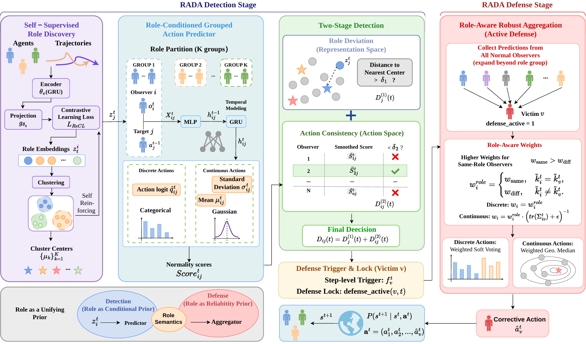

<div align="center">


# RADA

### Role-Aware Detection and Defense against Adversarial Action Attacks in Cooperative MARL

<p>


</p>


</div>

---

**RADA** is a role-aware framework that **detects** and **defends against** adversarial action-manipulation attacks on individual agents in cooperative multi-agent reinforcement learning (MARL). It builds a learned *role prior* from agent behavioral trajectories and reuses it twice:

- as a **conditional prior** during *detection* — deciding which observer→target pairs share a behavioral pattern, and
- as a **reliability prior** during *defense* — deciding which benign observers to trust when correcting a hijacked action.

The framework ships in **two parallel implementations** so the same idea can be evaluated across both major MARL regimes:

| Track            | Backbone     | Framework               | Benchmark                                      | Action space       |
| ---------------- | ------------ | ----------------------- | ---------------------------------------------- | ------------------ |
| 🟦 **Discrete**   | QMIX + ReCL  | PyMARL-style (`sacred`) | SMAC (e.g. `MMM`)                              | discrete           |
| 🟩 **Continuous** | MAPPO + ReCL | HARL-style              | PettingZoo MPE (`simple_spread`, `simple_tag`) | continuous (`Box`) |

> This README is organized into the two functional stages of the system — **[Detection](#-part-1--detection)** and **[Defense](#-part-2--defense)** — and each part documents both the **discrete** and **continuous** action spaces.

---

## 📑 Table of Contents

- [Highlights](#-highlights)
- [How RADA Works](#-how-rada-works)
- [Repository Layout](#-repository-layout)
- [Installation](#-installation)
- [Part 1 — Detection](#-part-1--detection)
  - [Discrete (QMIX + SMAC)](#detection--discrete-action-space-qmix--smac)
  - [Continuous (MAPPO + MPE)](#detection--continuous-action-space-mappo--mpe)
- [Part 2 — Defense](#-part-2--defense)
  - [Discrete (QMIX + SMAC)](#defense--discrete-action-space-qmix--smac)
  - [Continuous (MAPPO + MPE)](#defense--continuous-action-space-mappo--mpe)
- [Key Configuration Flags](#-key-configuration-flags)
- [Evaluation Metrics](#-evaluation-metrics)
- [Attack Models](#-attack-models)
- [Acknowledgments](#-acknowledgments)

---

## ✨ Highlights

- **Decentralized & role-aware.** Every benign agent can independently flag anomalies in any other agent, conditioned on learned role groups instead of fixed identities.

- **Two-stage hybrid detector.** A *role-deviation* test in representation space is combined **disjunctively** with an *action-consistency* test in action space, so an attacker must evade *both* signals to stay hidden.

- **Defense before the transition.** Once a victim is confirmed, RADA aggregates role-conditioned predictions from benign observers and **replaces the adversarial action before it enters the environment's state-transition function** — so the corrupted action is never actually executed.

- **Role-aware robust aggregation.** Weighted **soft voting** for discrete actions; weighted **geometric median** for continuous actions; same-role observers get higher weight.

- **Publication-ready evaluation.** ROC curves, detection-time-vs-FPR curves, score-trajectory plots, and reward-recovery metrics out of the box.

  

---

## 🧠 How RADA Works

RADA proceeds through four stages at each execution step:

```
                    ┌─────────────────────────────────────────────────────┐
                    │  Stage 1 · Self-Supervised Role Discovery            │
  trajectories ───▶ │  GRU encoder + projection head ──▶ role embeddings   │
                    │  KMeans ⇒ K role clusters (cluster centers = roles)  │
                    └───────────────────────┬─────────────────────────────┘
                                            │  role prior
                    ┌───────────────────────▼─────────────────────────────┐
                    │  Stage 2 · Role-Conditioned Action Prediction        │
                    │  shared predictor (MLP + GRU) per (observer i,        │
                    │  target j) pair  ⇒  pairwise normality score s_ij     │
                    └───────────────────────┬─────────────────────────────┘
                                            │
                    ┌───────────────────────▼─────────────────────────────┐
                    │  Stage 3 · Two-Stage Hybrid Detection                │
                    │  (a) role deviation  : dist(emb_v, nearest center)   │
                    │  (b) action mismatch : smoothed s_*→v  < threshold   │
                    │      ⇒ confirm victim v   (a OR b)                   │
                    └───────────────────────┬─────────────────────────────┘
                                            │  victim confirmed
                    ┌───────────────────────▼─────────────────────────────┐
                    │  Stage 4 · Role-Aware Robust Aggregation (Defense)   │
                    │  collect predictions from ALL benign observers       │
                    │  discrete  : weighted soft voting                    │
                    │  continuous: weighted geometric median               │
                    │  ⇒ corrective action ã_v  replaces adversarial a_v   │
                    │     BEFORE  P(s_{t+1} | s_t, a_t)                     │
                    └─────────────────────────────────────────────────────┘
```

**Detection = Stages 1–3.** **Defense = Stages 1–4** (defense reuses the detector and adds the aggregation/replacement step).

---

## 📂 Repository Layout

> Representative structure — adapt the paths to your local checkout.

```
RADA/
├── RADA-Defense/                                      # 🟩 MAPPO + Role + Tracker (HARL / PettingZoo MPE)
│   ├── examples/                                      #   training, attack, evaluation, and defense experiment entry points
│   │   ├── eval_attack_runner.py                      #   attack-integrated evaluation runner
│   │   ├── eval_tracker_performance.py                #   DETECTION evaluation: ROC, detection-time, distributions
│   │   ├── run_defense_experiment.py                  #   DEFENSE experiments: calibration / main / delay / trajectory
│   │   ├── run_phase1_5.py                            #   Phase 1.5 · collect role embeddings → KMeans clusters
│   │   ├── train.py                                   #   Phase 1   · train MAPPO + ReCL base policy                          
│   │   ├── train_attack.py                            #   train ACT / DYN attack policies
│   │   └── train_phase2.py                            #   Phase 2   · train the Tracker with ablation options
│   │
│   ├── harl/
│   │   └── algorithms/
│   │       ├── attackers/                            
│   │       │   ├── __init__.py                       
│   │       │   └── attacker.py                        #   attack-policy implementation and attack execution logic
│   │       │
│   │       ├── recl/                                  
│   │       │   ├── __init__.py                        
│   │       │   ├── recl.py                            #   ReCL training and role-representation logic
│   │       │   └── recl_net.py                        #   neural network for role embeddings / ReCL features
│   │       │
│   │       ├── trackers/                              
│   │       │   ├── __init__.py                        
│   │       │   ├── defense.py                         #   defense methods + reward-recovery metric η
│   │       │   ├── defense_eval_runner.py             #   runner patch for defense evaluation
│   │       │   ├── defense_trajectory.py              #   trajectory-level defense analysis and execution utilities
│   │       │   ├── tracker.py                         #   DecentralizedTracker: two-stage detector + training logic
│   │       │   ├── tracker_buffer.py                  #   recurrent episode replay buffer for tracker training
│   │       │   └── tracker_net.py                     #   TrackerAgentContinuous: Gaussian output head                         │
├── RADA-Detection/                                    # 🟦 QMIX + Role + Tracker (PyMARL / SMAC)
│   ├── config/
│   │   └── default.yaml                               
│   │
│   ├── controllers/                                   
│   │   ├── __init__.py                                
│   │   └── basic_controller.py                        #   basic multi-agent controller / policy interface
│   │
│   ├── learners/                                      
│   │   ├── __init__.py                                #   learner package initializer
│   │   ├── decentralizedTracker.py                    #   baseline decentralized tracker implementation
│   │   ├── decentralizedTracker_v2_defense.py         #   detector + role-aware defense extension
│   │   ├── q_learner.py                               #   QMIX learner with ReCL / tracker integration hooks
│   │   └── single_agent_rdqn.py                       #   recurrent DQN module for single-agent tracking decisions
│   │
│   ├── modules/
│   │   ├── roles/
│   │   │   └── role_nets.py                           #   neural networks for role representation learning
│   │   └── trackers/
│   │       └── tracker_agent.py                       #   tracker agent network architecture
│   │
│   ├── runners/
│   │   ├── __init__.py                                
│   │   ├── episode_runner.py                          #   single-environment rollout runner
│   │   └── parallel_runner.py                         #   parallel / vectorized rollout runner
│   │
│   ├── main.py                                        
│   ├── requirements.txt                              
│   └── run.py                                         
│
└── README.md                                          

```

---

## 🔧 Installation

```bash
# 1. Clone
git clone https://github.com/<your-org>/RADA.git
cd RADA

# 2. Create environment
conda create -n rada python=3.8 -y
conda activate rada

# 3. Core deps
pip install torch numpy scikit-learn matplotlib pyyaml

# 4a. Discrete track (SMAC) — requires StarCraft II + SMAC maps
pip install pysc2 smac

# 4b. Continuous track (PettingZoo MPE + attack training)
pip install pettingzoo "stable-baselines3>=2.0"
pip install sb3-contrib          # optional: LSTM attack policies
# pip install "ray[rllib]"       # optional: RLlib fallback for attack training
```

---

# 💡 Part 1 — Detection

The detection pipeline trains a base cooperative policy with role representations (**ReCL**), discovers role clusters, then trains the **Tracker** — a role-conditioned predictor that produces a *normality score* for every observer→target action. At test time, the two-stage detector flags victims under attack.

---

### Detection · Discrete action space (QMIX + SMAC)

A three-step pipeline on the `MMM` SMAC map. Steps share one `main.py` driven by `sacred` (`with key=value` overrides).

#### ① Phase 1 — Train QMIX + Role base policy

```bash
python main.py --config=qmix --env-config=sc2 with \
    env_args.map_name=MMM \
    use_recl=True \
    tracker_train=False \
    attack_active=False \
    cluster_num=3 \
    hidden_dim=128 \
    t_max=5050000 \
    epsilon_anneal_time=100000
```

#### ② Phase 2 — Train the Tracker

```bash
python main.py --config=qmix --env-config=sc2 with \
    env_args.map_name=MMM \
    tracker_train=True \
    train_tracker_phase=True \
    checkpoint_path="[PHASE1_MODEL_PATH]" \
    tracker_load_adr="[TRACKER_RESUME_PATH]" \
    tracker_train_episodes=50000 \
    tracker_hidden_dim=128 \
    hidden_dim=128 \
    cluster_num=3
```

- `checkpoint_path` → the frozen Phase-1 QMIX + ReCL weights.
- `tracker_load_adr` → (optional) resume Tracker training from a checkpoint; omit to start fresh.

#### ③ Evaluate detection (under attack)

```bash
python main.py --config=qmix --env-config=sc2 with \
    env_args.map_name=MMM \
    evaluate=True \
    attack_active=True \
    attack_type=DAA \
    adv_lambda=0 \
    adv_test_mode=True \
    attack_start_t=0 \
    checkpoint_path="[PHASE1_MODEL_PATH]" \
    tracker_load_adr="[TRACKER_MODEL_PATH]" \
    adv_load_adr="[ATTACK_MODEL_PATH]" \
    test_nepisode=400 \
    tracker_hidden_dim=128 \
    cluster_num=3 \
    hidden_dim=128
```

> `adv_lambda=0` is the **pure (overt) attack** used to measure raw detectability. Detection runs with `defense_active=False` (the default) so only the detector — not the corrective action — is active.

---

### Detection · Continuous action space (MAPPO + MPE)

A staged pipeline on PettingZoo MPE (`simple_spread_v2`, `obs_dim=36`; `simple_tag_v2`, `obs_dim=22`; both `action_dim=5`).

#### ① Phase 1 — Train MAPPO + ReCL base policy

```bash
python train.py --algo mappo --env pettingzoo_mpe \
    --exp_name mappo_simple_tag_phase1 \
    --use_recl True \
    env_args.scenario simple_tag_v2 \
    env_args.continuous_actions True
```

This writes a HARL run directory containing `config.json` and `models/` — both consumed by every later step.

#### ② Phase 2 — Train the Tracker (with ablation switch)

```bash
python train_phase2.py --algo mappo --env pettingzoo_mpe \
    --exp_name phase2_final \
    --load_config "[PHASE1_CONFIG]" \
    --phase1_model_dir "[PHASE1_MODEL_DIR]" \
    --tracker_hidden_dim 128 \
    --tracker_lr 0.0005 \
    --tracker_train_epochs 5 \
    --tracker_mini_batch_size 32 \
    --tracker_buffer_episodes 100 \
    --num_env_steps 5000000 \
    --ablation_variant full
```

Phase 2 **freezes** the MAPPO actor/critic and ReCL, re-initializes the Tracker network, and trains only the predictor.

#### ③ Evaluate detection

```bash
# simple_tag, single attack type (baseline auto-collected too)
python eval_tracker_performance.py \
    --phase1_model_dir [PHASE1_MODEL_DIR] \
    --phase2_model_dir [PHASE2_MODEL_DIR] \
    --attack_type ACT \
    --attack_model_path [ATTACK_MODEL_PATH] \
    --victim_idx 3 --num_episodes 100 \
    --scenario simple_tag_v2 --max_cycles 50
```

> ⚙️ `--auto_calibrate` (default **on**) re-derives cluster centers with the exact eval pipeline to fix the HARL *normalized-obs* vs. eval *raw-obs* mismatch. Disable with `--no_auto_calibrate`.

---

# 🛡️ Part 2 — Defense

Defense reuses the trained detector and adds **Stage 4**: when a victim is confirmed, RADA gathers role-conditioned predictions from benign observers and aggregates a **corrective action** that *replaces* the adversarial one before the environment steps. The result is measured by how much team reward is **recovered** relative to the undefended-under-attack baseline.

---

### Defense · Discrete action space (QMIX + SMAC)

Same `main.py` evaluation driver as detection, now with `defense_active=True` plus the defense-policy flags. The example below runs the **main RADA method, `D3` = role-aware weighted soft voting**:

```bash
python main.py --config=qmix --env-config=sc2 with \
    env_args.map_name=MMM \
    evaluate=True \
    attack_active=True \
    attack_type=DAA \
    adv_lambda=0.015 \
    adv_test_mode=True \
    attack_start_t=0 \
    checkpoint_path="[PHASE1_MODEL_PATH]" \
    tracker_load_adr="[TRACKER_MODEL_PATH]" \
    adv_load_adr="[ATTACK_MODEL_PATH]" \
    test_nepisode=200 \
    tracker_hidden_dim=128 \
    cluster_num=3 \
    hidden_dim=128 \
    defense_active=True \
    defense_mode="action_replace" \
    vote_mode="role_soft" \
    detect_strategy="all" \
    label="D3_role_soft"
```

<details>
<summary><b>Defense knobs &amp; method matrix</b></summary>


| Flag              | Values                                   | Meaning                                                |
| ----------------- | ---------------------------------------- | ------------------------------------------------------ |
| `defense_active`  | `True` / `False`                         | Master switch for Stage 4 correction                   |
| `defense_mode`    | `action_replace`                         | Replace the adversarial action with the corrective one |
| `vote_mode`       | `hard`, `role_hard`, `soft`, `role_soft` | Aggregation rule (see below)                           |
| `detect_strategy` | `same_role_only`, `all`                  | Which observers contribute to the corrective vote      |
| `adv_lambda`      | e.g. `0.015`                             | Attacker stealth weight (larger ⇒ stealthier `DAA`)    |
| `label`           | free string                              | Tag used for result bookkeeping                        |

---

### Defense · Continuous action space (MAPPO + MPE)

Driven by `run_defense_experiment.py`.

#### ① Calibrate the detection threshold (no attack)

```bash
python run_defense_experiment.py \
    --load_config [PHASE1_CONFIG] \
    --model_dir   [PHASE1_MODEL_DIR] \
    --experiment  calibrate \
    --calibrate_episodes 50 \
    --target_fpr 0.05 \
    --ema_window 5
```

Prints a suggested `η*` to plug into `--detection_threshold` below.

#### ② Main comparison (all defense methods vs. attack)

```bash
python run_defense_experiment.py \
    --load_config [PHASE1_CONFIG] \
    --model_dir   [PHASE1_MODEL_DIR] \
    --experiment  main \
    --attack_type ACT \
    --attack_model [ATTACK_MODEL_PATH] \
    --detection_threshold [CALIBRATED_THRESHOLD] \
    --victim_id 3 \
    --n_episodes 500 \
    --w_same 3.0 --w_diff 1.0
```

- `--w_same` / `--w_diff` set the **role-aware aggregation weights** (same-role vs. different-role observers).

---

## ⚙️ Key Configuration Flags

<details open>
<summary><b>Shared / detection</b></summary>


| Flag (discrete · continuous)                                 | Default   | Description                                             |
| ------------------------------------------------------------ | --------- | ------------------------------------------------------- |
| `cluster_num` · `--num_clusters`                             | `3` · `2` | Number of role clusters `K`                             |
| `hidden_dim` / `tracker_hidden_dim` · `--tracker_hidden_dim` | `128`     | GRU / FC hidden size                                    |
| `role_dev_threshold`                                         | `12.0`    | Stage-1 role-deviation threshold (representation space) |
| detection thresholds                                         | -3        | Stage-2 log-prob score thresholds                       |

<details>
<summary><b>Attack</b></summary>


| Flag                             | Description                                          |
| -------------------------------- | ---------------------------------------------------- |
| `attack_type` / `--attack_type`  | Discrete: `DAA`. Continuous: `ACT`, `DYN`            |
| `adv_lambda` / `--attack_lambda` | Stealth weight `λ` (only meaningful for `DYN`/`DAA`) |
| `victim_idx` / `--victim_id`     | Index of the attacked agent                          |
| `attack_start_t`                 | Step at which the attack begins                      |

<details>
<summary><b>Defense</b></summary>


| Flag                    | Description                                            |
| ----------------------- | ------------------------------------------------------ |
| `defense_active`        | Enable corrective replacement                          |
| `defense_mode`          | `action_replace`                                       |
| `vote_mode`             | `hard` / `role_hard` / `soft` / `role_soft` (discrete) |
| `detect_strategy`       | `same_role_only` / `all` (which observers vote)        |
| `--w_same` / `--w_diff` | Same-/different-role aggregation weights (continuous)  |
| `--detection_threshold` | Calibrated `η*` from the `calibrate` experiment        |

---

## 📊 Evaluation Metrics

**Detection**

- **ROC AUC** — episode-level and step-level (TPR vs. FPR over score thresholds).
- **Detection time vs. FPR** — average steps-to-detect at each false-positive rate.
- **Detection rate vs. FPR** — fraction of attacks caught.
- **Score distributions** — normality-score histograms, attacked vs. normal.

**Defense**

- **Reward Recovery Rate** — how much team reward the defense restores:

  ```
  η = (R_defense − R_attack) / (R_normal − R_attack) × 100%
  ```

  where `R_normal` = clean reward, `R_attack` = undefended-under-attack reward, `R_defense` = defended-under-attack reward. `η = 100%` means full recovery to clean performance.

---

## 🎯 Attack Models

| Name  | Track                 | Idea                                                         |
| ----- | --------------------- | ------------------------------------------------------------ |
| `ACT` | discrete · continuous | Pure action replacement (overt). In the discrete code this is `attack_type=DAA` with `adv_lambda=0`. |
| `DYN` | discrete · continuous | Stealthy attack regularized by `λ` to evade detection. In the discrete code this is `attack_type=DAA` with `adv_lambda>0`. |

> **Naming.** The paper refers to the overt and stealthy attacks as **ACT** and **DYN** in *both* action spaces. The discrete (SMAC) code exposes a single flag `attack_type=DAA` and switches regime through `adv_lambda` (`0` = overt / ACT, `>0` = stealthy / DYN), whereas the continuous (MPE) code uses the explicit `ACT` / `DYN` names directly.

The `DYN` attacker can be trained *against* a known Tracker (pass `--phase2_model_dir`) to stress-test the detector under a detection-aware adversary.

---

## 🙏 Acknowledgments

RADA builds on several excellent open-source projects, and we thank their authors:

- **[anomaly-detection-in-cMARL](https://github.com/kiarashkaz/anomalydetection-in-cMARL/)** — the decentralized anomaly-detection approach (**DAD**) that serves as our detection baseline and the starting point for the two-stage detector.
- **[ACORM](https://github.com/NJU-RL/ACORM)** — attention-guided contrastive role representation, which informed the self-supervised role-discovery module (**ReCL**) used to build the role prior.
- **[HARL](https://github.com/PKU-MARL/HARL)** — the actor–critic library underlying our continuous-action (MAPPO + MPE) track.

